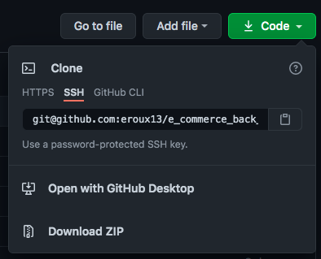
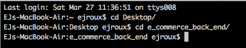
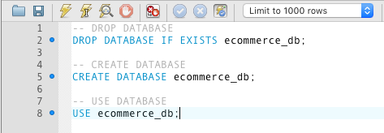
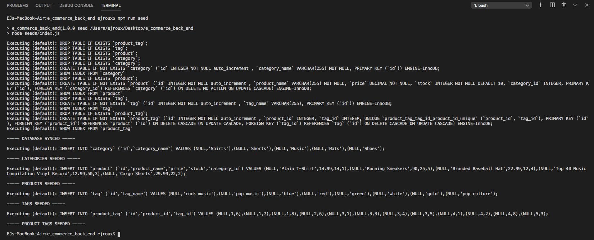
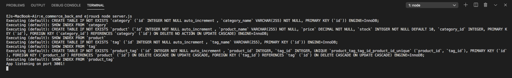
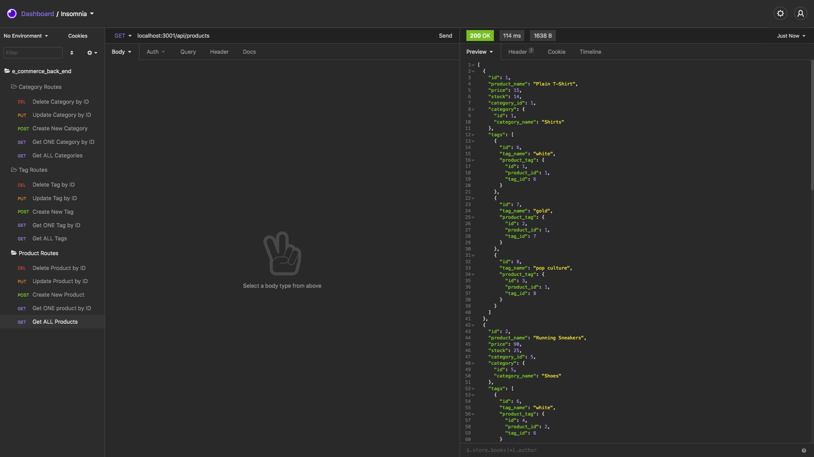
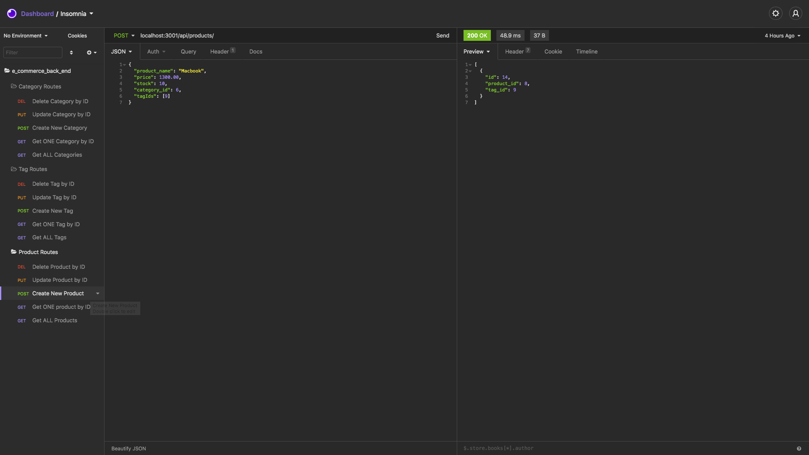
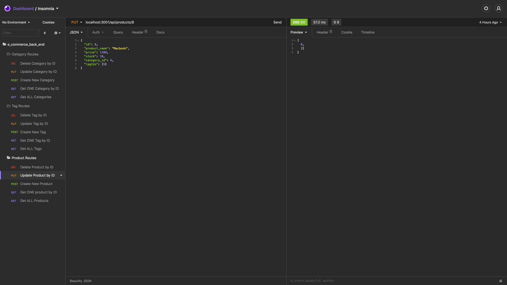
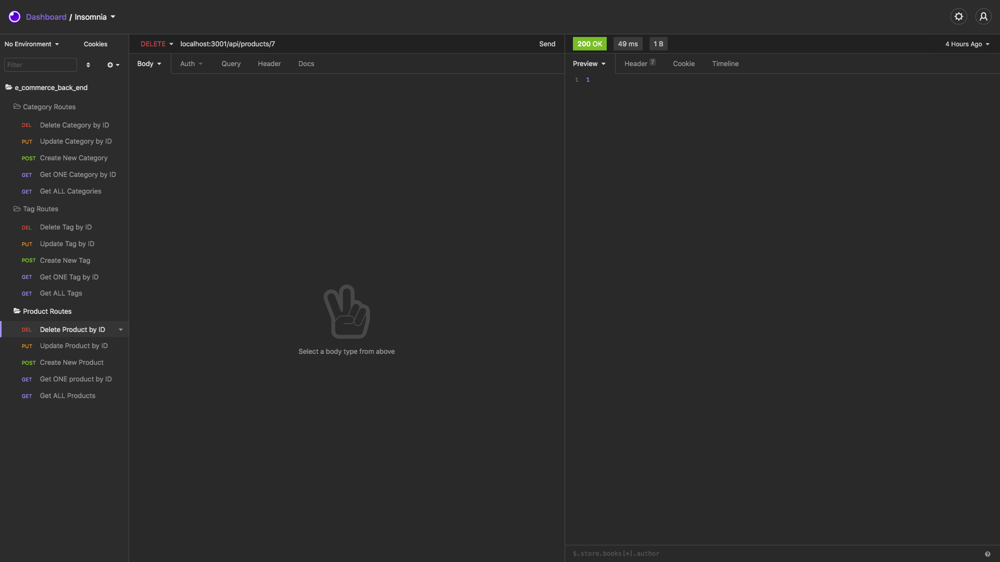

# E-Commerce Back End

## Description

The purpose of this project is to build the back end for an e-commerce site. With this project, a user can can perform CRUD operations for the Product, Tag, and Category Tables in the database. This project features the use of [Express.js](https://expressjs.com/) for server side functions and [Sequelize](https://sequelize.org/) to interact with the [MySQL](https://www.mysql.com/) database.

[Video Walkthrough Part 1](https://drive.google.com/file/d/1fxwr5rhaKRIGdhfsRsO_IsErI7L9vdnZ/view)
[Video Walkthrough Part 2](https://drive.google.com/file/d/13KfSghqan3pknrAqVgZ77lPTgr3uDYZP/view)

## Table of Contents

- [Description](#description)
- [License](#license)
- [Installation](#installation)
- [Usage](#usage)
- [Contributors](#contributors)
- [Tests](#tests)
- [Questions](#questions)

## License

License chosen: MIT.
More information about the license chosen can be found on [Open Source Initiative](https://opensource.org/licenses/MIT).

## Installation

To install this project, the user needs to clone the repository to their local machine.

Next the user needs to navigate into the directory on their machine using either Terminal or Git Bash depending on the user's OS. The user could also use the integrated command-line in VS Code.

Once in the directory, the user needs to navigate the file tree to find the `schema.sql` file. Once the file has been found, the user can copy and paste the code into MySQL Workbench to create the database.

After creating the database, the user needs to populate it using the provided seeds by running `npm run seed` in either Terminal or Git Bash depending on the user's OS. The user could also use the integrated command-line in VS Code.

Once that is complete then the user can start the server by running `node server.js` in either Terminal or Git Bash depending on the user's OS. The user could also use the integrated command-line in VS Code. If successful, the terminal should log `App listening on port 3001!`.

## Usage

The usage of this project is to be able to perform CRUD operations through API routes such as GET, POST, PUT, and DELETE, instead of directly inputting queries in MySQL Workbench.

## Contributors

[eroux13](https://www.github.com/eroux13)

## Tests

Once the user has successfully installed the project, the user can test the API Endpoints through [Insomnia Core](https://insomnia.rest/). From here, the user can test the GET routes that return all data from either the Product, Tag, or Category Table, of they can test the GET route that returns a single row based on id.

The user can also test the POST routes, which is used to create new data in either the Product, Tag, or Category Table.

The user can also thes the PUT routes, which is used to update existing information in the Product, Tag, or Category Table.

Lastly, the user can test the DELETE routes, which is used to delete existing information from the Product, Tag, or Category Table.

## Questions

Feel free to follow my GitHub [profile](https://www.github.com/eroux13).
If you have any questions about this project, please reach out to me via ej.roux13@gmail.com.
